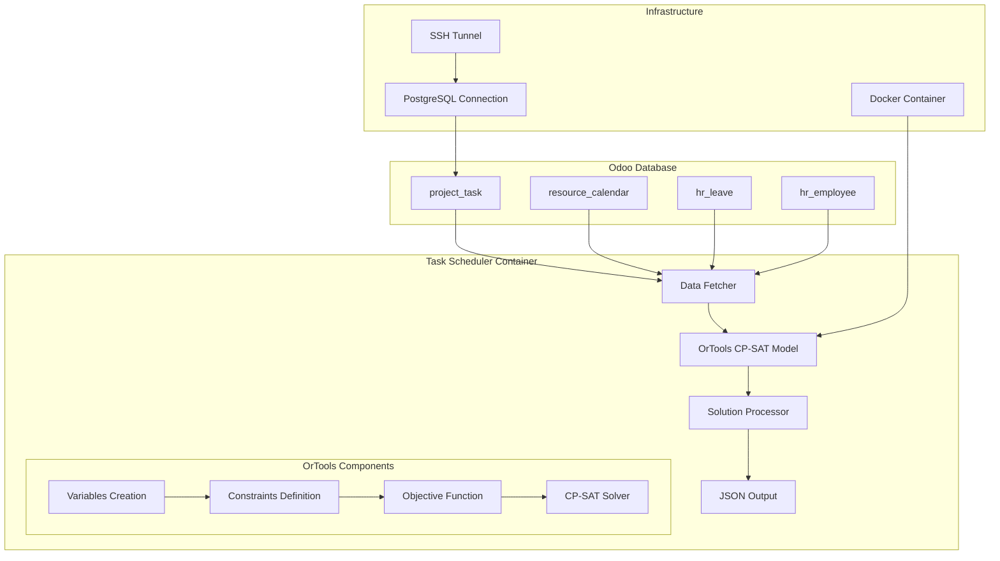

# TASK Scheduler con OrTools

Un sistema di pianificazione delle attività ottimizzato, progettato per l'allocazione intelligente delle risorse e la pianificazione automatica delle attività utilizzando Google OrTools CP-SAT solver.

## 🚀 Caratteristiche

- **Pianificazione automatica** delle attività basata su vincoli complessi
- **Integrazione nativa con Odoo 10** per gestione lavanderie industriali
- **API REST** per invocazione da sistemi esterni (incluso Odoo 12)
- **Solver OrTools CP-SAT** per ottimizzazione ad alte prestazioni
- **Supporto PostgreSQL** con connessioni sicure
- **Tunnel SSH** per connessioni a database remoti
- **Gestione calendari e assenze** del personale
- **Containerizzazione Docker** completa
- **Shell interattiva** per controllo e monitoraggio
- **Visualizzazione grafica** con diagrammi di Gantt, timeline interattive e report HTML

## 📋 Requisiti

- Docker e Docker Compose
- Python 3.11+
- Google OrTools (installato automaticamente)
- Accesso a database Odoo 10

## 🏗️ Architettura del Sistema



## 🔧 Struttura del Progetto

```
task-scheduler/
├── src/                        # Codice sorgente principale
│   ├── __init__.py
│   ├── run.py                  # Punto di ingresso e shell interattiva
│   ├── config.py               # Configurazioni OrTools e database
│   ├── db.py                   # Gestione connessioni database
│   ├── fetch.py                # Recupero dati da Odoo
│   └── scheduler/              # Logica di scheduling
│       ├── __init__.py
│       ├── model.py            # Modello OrTools CP-SAT
│       └── utils.py            # Funzioni di utilità
├── tests/                      # Test unitari
│   └── test_schedule_model.py
├── logs/                       # Directory per i log
├── data/                       # Directory per output JSON
├── _tmp/                       # File temporanei e di lavoro
├── Dockerfile                  # Configurazione container
├── docker-compose.yml          # Orchestrazione servizi
├── requirements.txt            # Dipendenze Python
├── setup.py                    # Setup del pacchetto
├── .env.example               # Template configurazione
├── .gitignore
└── README.md
```

## 🛠️ Installazione

### 1. Clone del Repository

```bash
git clone https://github.com/yourusername/task-scheduler.git
cd task-scheduler
```

### 2. Configurazione Ambiente

```bash
cp .env.example .env
```

Modifica il file `.env` con le tue configurazioni:

```env
# Database Odoo
DB_HOST=your-odoo-host
DB_PORT=5432
DB_NAME=your_odoo_db
DB_USER=your_user
DB_PASSWORD=your_password

# OrTools Parameters
ORTOOLS_TIME_LIMIT=3600
ORTOOLS_WORKERS=4
ORTOOLS_LOG_PROGRESS=false
ORTOOLS_OUTPUT_FILE=/app/data/schedule.json

# Task Configuration
TASK_IDS=1,2,3,4,5
TASK_LIMIT=20
```

### 3. Avvio Container

```bash
docker-compose up -d
```

## 🎯 Utilizzo

### Shell Interattiva

```bash
docker-compose exec task-scheduler python -m src.run
```

Comandi disponibili:
- `run [task_ids]` - Esegue la pianificazione
- `status` - Mostra stato del sistema
- `list` - Elenca task pendenti
- `exit` - Esce dall'applicazione

### Esecuzione Diretta

```bash
# Pianifica task specifici
docker-compose exec task-scheduler python -m src.run

# Visualizza log
docker-compose logs -f task-scheduler
```

## 🔍 Modello di Ottimizzazione

### Variabili di Decisione

```python
x[task_id, date, hour] = True  # Se task è schedulato in quella data/ora
day[task_id, date] = True      # Se task usa quel giorno
```

### Vincoli Principali

1. **Ore Pianificate**: Ogni task deve essere completato esattamente per le ore richieste
2. **Disponibilità Risorse**: Una risorsa può fare solo un task per slot
3. **Calendari di Lavoro**: Rispetto degli orari di lavoro
4. **Gestione Assenze**: Esclusione giorni di ferie/malattia

### Estensione Automatica dell'Orizzonte Temporale

Il sistema garantisce sempre una soluzione fattibile attraverso:
- Orizzonte temporale iniziale di 28 giorni (4 settimane)
- Estensione automatica dell'orizzonte se non viene trovata una soluzione
- Mantenimento rigoroso dei vincoli (nessun rilassamento)
- Fattore di estensione configurabile (default: raddoppio dell'orizzonte)

```python
# Esempio di configurazione
model = SchedulingModel(
    tasks_df,
    calendar_slots_df,
    leaves_df,
    initial_horizon_days=28,     # Orizzonte iniziale
    horizon_extension_factor=2   # Fattore di estensione
)
```

### Funzione Obiettivo

Minimizza la dispersione temporale delle attività per favorire:
- Concentrazione delle attività in giorni contigui
- Riduzione dei tempi di setup
- Ottimizzazione dell'utilizzo delle risorse

## 📊 Integrazione Odoo

### Tabelle Utilizzate

```sql
-- Task da pianificare
SELECT t.id, t.name, t.user_id, t.planned_hours
FROM project_task t
INNER JOIN project_task_type pt ON t.stage_id = pt.id
WHERE t.planned_hours > 0 AND pt.closed = false;

-- Calendari di lavoro
SELECT t.id as task_id, rca.dayofweek, rca.hour_from, rca.hour_to
FROM project_task t
JOIN hr_employee e ON e.id = t.employee_id
JOIN resource_calendar rc ON rc.id = e.resource_calendar_id
JOIN resource_calendar_attendance rca ON rca.calendar_id = rc.id;

-- Assenze del personale
SELECT t.id as task_id, l.date_from, l.date_to
FROM project_task t
JOIN hr_employee e ON e.id = t.employee_id
JOIN hr_leave l ON l.employee_id = e.id
WHERE l.state = 'validate';
```

## 🐳 Configurazione Docker

### Vantaggi della Migrazione a OrTools

- **Dimensione ridotta**: Da ~2GB a ~500MB
- **Build più veloce**: Eliminata compilazione SCIP
- **Meno dipendenze**: Solo build-essential necessario
- **Maggiore stabilità**: Meno punti di fallimento

### Dockerfile Ottimizzato

```dockerfile
FROM python:3.11-slim

ENV PYTHONDONTWRITEBYTECODE=1 \
    PYTHONUNBUFFERED=1

# Dipendenze minime
RUN apt-get update && apt-get install -y \
    build-essential \
    && apt-get clean

# Installazione OrTools via pip
RUN pip install ortools>=9.8.3296
```

## 🔧 Configurazione Avanzata

### Parametri OrTools

```env
# Limite tempo di risoluzione (secondi)
ORTOOLS_TIME_LIMIT=3600

# Numero di worker paralleli
ORTOOLS_WORKERS=4

# Log dettagliato del progresso
ORTOOLS_LOG_PROGRESS=true

# File di output
ORTOOLS_OUTPUT_FILE=/app/data/schedule.json
```

### Parametri di Estensione dell'Orizzonte

Questi parametri possono essere configurati nel codice:

```python
# In src/run.py
model = SchedulingModel(
    tasks_df,
    calendar_slots_df,
    leaves_df,
    initial_horizon_days=28,     # Orizzonte iniziale in giorni
    horizon_extension_factor=2   # Fattore di moltiplicazione per ogni estensione
)
```

### Tunnel SSH per Database Remoti

```env
SSH_ENABLED=true
SSH_HOST=remote.example.com
SSH_PORT=22
SSH_USERNAME=user
SSH_KEY_PATH=/app/ssh_key
```

## 📊 Visualizzazione Grafica

Il sistema genera automaticamente diversi tipi di grafici per visualizzare i risultati della pianificazione:

### Tipi di Grafici Disponibili

1. **📅 Diagramma di Gantt**
   - Visualizzazione temporale delle attività
   - Colori diversi per ogni task
   - Informazioni su utenti e durata

2. **⏱️ Timeline Interattiva**
   - Grafico Plotly interattivo
   - Zoom e pan per esplorare i dettagli
   - Hover per informazioni aggiuntive

3. **👥 Utilizzo Risorse**
   - Ore programmate per utente per giorno
   - Percentuale di utilizzo delle risorse
   - Identificazione di sovraccarichi

4. **📊 Distribuzione Task**
   - Ore totali per task
   - Giorni utilizzati per task
   - Confronto ore pianificate vs programmate
   - Distribuzione del carico per utente

### Output Generati

```bash
/app/data/
├── gantt_chart.png              # Diagramma di Gantt
├── timeline_chart.html          # Timeline interattiva
├── resource_utilization.png     # Grafici utilizzo risorse
├── task_distribution.png        # Distribuzione task
├── scheduling_report.html       # Report completo HTML
└── schedule.json               # Dati JSON della soluzione
```

### Esempio di Utilizzo

```python
from src.scheduler.visualization import ScheduleVisualizer

# Crea il visualizzatore
visualizer = ScheduleVisualizer(solution_df, tasks_df)

# Genera tutti i grafici
charts = visualizer.generate_all_charts()

# Crea report HTML completo
report_path = visualizer.create_summary_report(charts)
```

### Report HTML

Il sistema genera automaticamente un report HTML completo che include:
- Statistiche generali della pianificazione
- Tutti i grafici generati
- Link alla timeline interattiva
- Styling professionale per presentazioni

## 📈 Performance e Monitoraggio

### Statistiche Solver

Il sistema fornisce metriche dettagliate:

```json
{
  "status": "OPTIMAL",
  "objective_value": 15,
  "wall_time": 2.34,
  "num_branches": 1247,
  "num_conflicts": 89,
  "num_booleans": 2856,
  "num_constraints": 1432
}
```

### Output della Pianificazione

```json
{
  "tasks": {
    "123": [
      {"date": "2025-06-24", "hour": 9},
      {"date": "2025-06-24", "hour": 10},
      {"date": "2025-06-25", "hour": 14}
    ]
  },
  "objective_value": 15,
  "status": "OPTIMAL",
  "solve_time": 2.34,
  "horizon_days": 56
}
```

Il campo `horizon_days` indica l'orizzonte temporale finale utilizzato per trovare la soluzione. Se questo valore è maggiore dell'orizzonte iniziale (28 giorni), significa che il sistema ha dovuto estendere l'orizzonte per trovare una soluzione fattibile.

## 🧪 Testing

```bash
# Esegui tutti i test
docker-compose exec task-scheduler pytest

# Test con coverage
docker-compose exec task-scheduler pytest --cov=src

# Test specifici
docker-compose exec task-scheduler pytest tests/test_schedule_model.py
```

## 🚨 Troubleshooting

### Problemi Comuni

1. **Connessione Database**
   ```bash
   # Verifica connettività
   docker-compose exec task-scheduler python -c "from src.db import get_db_connection; print(get_db_connection())"
   ```

2. **Soluzioni con Orizzonte Esteso**
   - Il sistema estenderà automaticamente l'orizzonte temporale fino a trovare una soluzione
   - Se l'orizzonte diventa molto ampio, verifica:
     - Disponibilità calendari (giorni/ore lavorative sufficienti)
     - Assenze eccessive che limitano gli slot disponibili
   - Aumenta ORTOOLS_TIME_LIMIT per orizzonti molto estesi

3. **Performance Lente**
   - Riduci TASK_LIMIT
   - Aumenta ORTOOLS_WORKERS
   - Ottimizza query database

### Log e Debug

```bash
# Log in tempo reale
docker-compose logs -f task-scheduler

# Log con livello debug
docker-compose exec task-scheduler LOG_LEVEL=DEBUG python -m src.run
```

## 🌐 API REST

Il Task Scheduler espone un'API REST che consente di invocare lo scheduler da sistemi esterni, come un'istanza Odoo 12, e ottenere i risultati della pianificazione in formato JSON.

### Avvio del Server API

```bash
# Avvia il servizio API con Docker Compose
docker-compose up -d task-scheduler-api

# Avvio manuale (senza Docker)
python -m src.run_api --host 0.0.0.0 --port 5000
```

### Endpoint Principali

1. **Avvia una pianificazione**
   - `POST /api/v1/schedule`
   - Parametri: task_ids, initial_horizon_days, horizon_extension_factor
   - Risposta: 202 Accepted con dettagli della pianificazione avviata

2. **Verifica lo stato della pianificazione**
   - `GET /api/v1/schedule/status`
   - Risposta: Stato attuale, tempi di esecuzione, messaggi

3. **Recupera i risultati della pianificazione**
   - `GET /api/v1/schedule/result`
   - Risposta: Risultati completi in formato JSON

### Integrazione con Odoo 12

L'API può essere facilmente integrata con Odoo 12 creando un modulo personalizzato che estende i modelli `project.task` e `project.task.type`. Un esempio di implementazione è disponibile nel file `_tmp/odoo12_client_example.py`.

```python
# Esempio di chiamata API da Odoo 12
def action_schedule_tasks(self):
    task_ids = self.mapped('id')
    response = requests.post(
        "http://task-scheduler-api:5000/api/v1/schedule",
        json={"task_ids": task_ids}
    )
    # Gestisci la risposta...
```

Per una documentazione completa dell'API, consultare il file `_tmp/API_README.md`.

## 🔄 Migrazione da SCIP

### Differenze Principali

| Aspetto | SCIP | OrTools |
|---------|------|---------|
| Installazione | Compilazione complessa | pip install |
| Dimensione | ~2GB | ~500MB |
| Sintassi | pyscipopt | ortools.sat |
| Performance | Buona | Eccellente |
| Manutenzione | Complessa | Semplice |

### Compatibilità

- ✅ Stesso formato output JSON
- ✅ Stesse query Odoo
- ✅ Stessa configurazione Docker Compose
- ✅ Stessa shell interattiva
